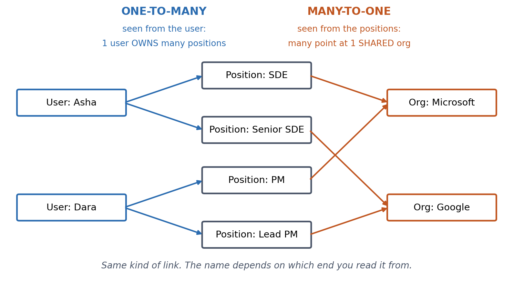

% Chapter 2 — Practical Task 01: Relationships and Data Models
% Road to Architect — Designing Data-Intensive Applications
% Chapter 2: Data Models and Query Languages

## 1. One-to-many vs many-to-one: it depends on where you stand

{ width=78% }

- **User → positions is one-to-many.** Each position is *owned* by one user.
  That makes a tree, so it nests inside a JSON document.
- **Positions → org is many-to-one.** The org is *shared* and exists on its
  own. A document can only **copy** it (and the copies drift) or **reference
  it by ID** (which needs a join).
- **Rule:** owned means nest it; shared means reference it. The foreign key
  goes on the "many" side (`positions.org_id`).

## 2. How three generations of databases handled this

| Model | Example | Shape | Many-to-one handled by | Pain |
|-------------|----------|--------------|----------------|--------------------------------|
| **Hierarchical** | IBM IMS (1960s) | Tree: each record has one parent | Not supported: duplicate, or link by hand | Same as JSON docs today: duplication, drift |
| **Network** | CODASYL (1970s) | Graph: a record can have many parents | Pointers between records | You hand-code the **access path** (which pointers to follow). A schema change breaks queries |
| **Relational** | SQL (1970s onward) | Flat tables | Foreign key + join | Assembling a whole resume needs joins. The **query optimizer** picks the path, so you only say *what* you want |

**Where things stand now:** document databases are the hierarchical model
again for one-to-many data, where locality means one read gets the whole
resume. For many-to-one data they use **document references**, which are
foreign keys in disguise and need a join in app code or `$lookup`.

## 3. Hands-on (about 10 minutes, SQLite ships with macOS)

`practical_01_resume_models/` has the same 4 resumes stored twice: as JSON
documents with org names typed freely (`"Microsoft"`, `"Microsoft Corp"`,
`"microsoft"`), and as normalized tables.

```bash
cd practical_01_resume_models
sqlite3 resumes.db < seed.sql
sqlite3 -box resumes.db     # paste sections from exercises.sql
```

Fill in the **two relational `TODO`s**. The document-model queries are
already written. What to notice:

1. **"Who worked at Microsoft?"** The answer is 4. The document query finds
   2, because the duplicated copies drifted. Your join finds 4.
2. **Rename to "Microsoft Corporation".** The document update rewrites 2
   documents and silently misses the other copies. Yours touches 1 row.

## 4. Decide

Write your pick (document / relational / document + ID references) before
reading the answer.

**A.** Blog: a post plus its comments, always displayed whole. Nobody queries
comments across posts.\
*Answer: document.* It's a pure one-to-many tree, and you always load the
whole thing.

**B.** Resume site adds company pages: logo, "people who work here", "people
you may know from Google".\
*Answer: relational.* Org has become a shared entity that people query from
the org's end.

**C.** Resume site in its first month, with company pages expected next
quarter.\
*Answer: document + ID references.* Keep positions nested, but store
`org_id` rather than the org name. You keep the one-read resume and get a
single source of truth for orgs, at the cost of joining in app code.

## Checklist

1. Owned or shared?
2. Always read as a whole? If so, document locality wins.
3. Queried from the other end? Then it needs to be an entity with an ID.
4. How many places does a change touch? More than one is duplication.
